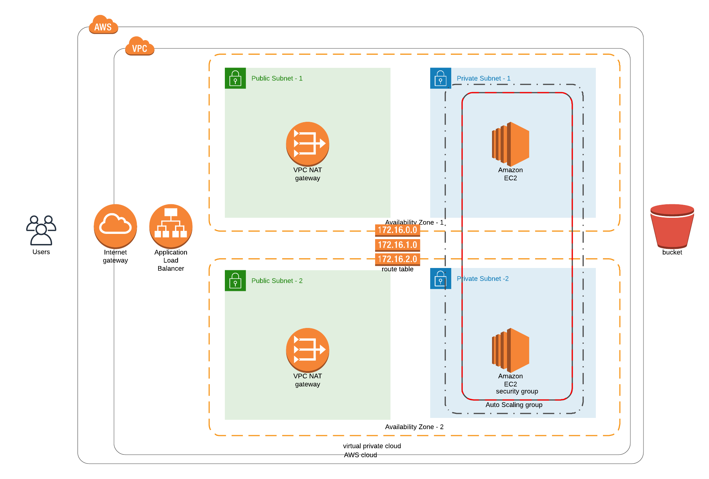

# Udacity - Cloud DevOps Engineer - Project 2

Codes written in [Udacity's Cloud DevOps Engineer Nanodegree Course](https://www.udacity.com/course/cloud-dev-ops-nanodegree--nd9991).

Project 2: Deploy a high-availability web app using CloudFormation

This is the infrastructure diagram for what this cloudformation script deploys



## Pre-requisites

* You must have an [Amazon Web Services (AWS) account](http://aws.amazon.com/).
* You must have [AWS Command Line Interface](https://aws.amazon.com/cli/) installed on your computer. 

## Quick start

**Please note that this example will deploy real resources into your AWS account. We have made every effort to ensure 
all the resources qualify for the [AWS Free Tier](https://aws.amazon.com/free/), but we are not responsible for any
charges you may incur.** 

Configure your [AWS access](https://docs.aws.amazon.com/cli/latest/userguide/cli-chap-configure.html):

```
aws configure
```

## Description of Parameters

* STACK-NAME - The  name that is associated with the stack. The name must be unique in the region in which you are creating the stack.

* TEMPLATE-BODY - Structure containing the template body with a minimum  length  of  1 byte  and a maximum length of 51,200 bytes. For more information, go to Template Anatomy in the AWS CloudFormation User Guide.

* PARAMETERS - A list of Parameter structures that specify input parameters for the stack. 

For more information, try 
```
aws cloudformation create-stack help
aws cloudformation update-stack help
aws cloudformation delete-stack help
```


Deploy Infrastructure:

```
./create.sh $STACK-NAME $TEMPLATE-BODY $PARAMETERS
```

Update Infrastructure:

```
./update.sh $STACK-NAME $TEMPLATE-BODY $PARAMETERS
```

Clean up when you're done:

```
./delete.sh $STACK-NAME
```